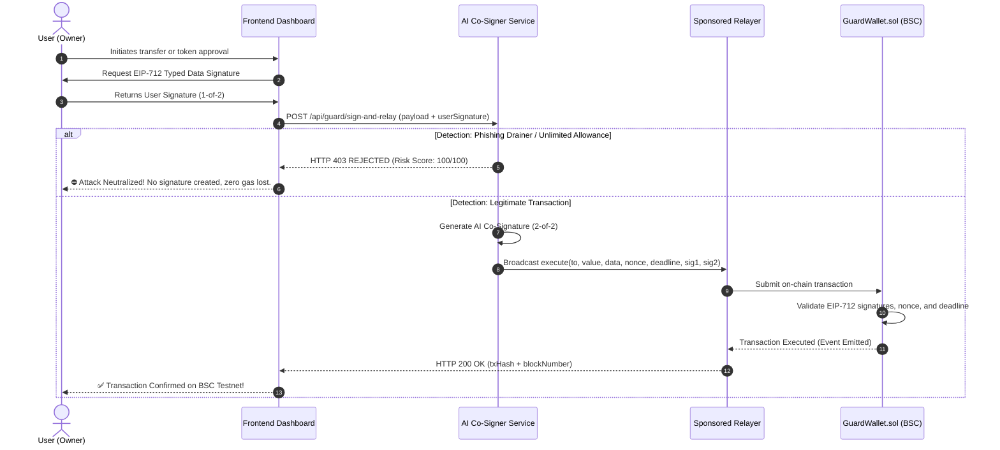

# 🛡️ AI Co-Signer Guard Wallet

> **Autonomous 2-of-2 Multi-Sig Smart Contract Wallet with Synchronous Pre-Execution AI Security Guardrails on BNB Smart Chain Testnet (Chain ID 97).**

[-F0B90B?logo=binance&logoColor=black)](https://testnet.bscscan.com)
[](https://soliditylang.org/)
[](https://getfoundry.sh/)
[](https://bun.sh/)
[](https://deepmind.google/technologies/gemini/)
[](https://eips.ethereum.org/EIPS/eip-712)
[](https://frontend-beige-seven-88.vercel.app)

---

## 📌 Executive Summary

Every day, Web3 users lose millions of dollars to **phishing drainers**, **blind approval exploits** (`approve(spender, MaxUint256)`), and **malicious calldata**. Traditional wallets offer no built-in pre-execution protection, while conventional multisigs (such as Gnosis Safe) require manual human co-signers that are impractical for everyday retail transactions.

**AI Co-Signer Guard Wallet** solves this by introducing an **on-chain 2-of-2 multi-sig smart contract wallet** governed by an **autonomous off-chain AI Security Agent**. Every transaction requires two valid ECDSA signatures over an **EIP-712 typed data digest**:
1. **Signature 1-of-2:** The User (Contract Owner).
2. **Signature 2-of-2:** The AI Co-Signer (provided *only* if the transaction passes comprehensive automated security inspection).

If a transaction indicates a phishing drainer, abnormal token allowance, or contract exploit, **the AI refuses to sign**, halting the attack **before** it can ever enter the mempool or consume gas.

---

## 🌐 Live On-Chain Deployment (BSC Testnet)

| Parameter | Value / Address |
| :--- | :--- |
| **Live Web App (Vercel)** | [`https://frontend-beige-seven-88.vercel.app`](https://frontend-beige-seven-88.vercel.app) |
| **Network** | BNB Smart Chain Testnet (Chain ID: `97`) |
| **GuardWallet Contract** | [`0x7e98f1fD70Ffe550A6ee616dB0925fb7e5522C8a`](https://testnet.bscscan.com/address/0x7e98f1fD70Ffe550A6ee616dB0925fb7e5522C8a) |
| **Contract Deployment Tx** | [`0x4a69acb6696e6280799e3f2e5ba5ca8b07d8c89ad5650bda5eba4bcc2702751d`](https://testnet.bscscan.com/tx/0x4a69acb6696e6280799e3f2e5ba5ca8b07d8c89ad5650bda5eba4bcc2702751d) |
| **Contract Owner** | `0x6543e13fC2F5b68655D537a2A637d31Fe98b42c0` |
| **AI Co-Signer Signer** | `0x4f1153deeA6a184913b214b50cC32c7fBc009A03` |
| **Live Multi-Sig Relay Tx** | [`0x86c766cfcd793af2392c0951f25f7649060f4be19ce68f2389c0dbdcc0d0bf83`](https://testnet.bscscan.com/tx/0x86c766cfcd793af2392c0951f25f7649060f4be19ce68f2389c0dbdcc0d0bf83) |

---

## 🏛️ System Architecture

```text
                                      +---------------------------------------------+
                                      |            Web3 User / DApp UI              |
                                      +---------------------------------------------+
                                                             |
                                           1. Sign EIP-712 Typed Data (1-of-2)
                                                             v
                                      +---------------------------------------------+
                                      |         AI Guardrail Security Engine        |
                                      |      (Google Gemini + Calldata Parser)      |
                                      +---------------------------------------------+
                                            /                                 \
                    [If Phishing / Drainer] /                                   \ [If Safe & Valid]
                                          /                                     \
                                         v                                       v
                     +-----------------------+               +--------------------------------------+
                     |   REJECT TRANSACTION  |               |  Sign EIP-712 with AI Signer (2-of-2)|
                     |  (HTTP 403 Forbidden) |               +--------------------------------------+
                     |  NO GAS, NO BROADCAST |                                  |
                     +-----------------------+                                  | 2. Auto-Relay
                                                                                v
                                                             +--------------------------------------+
                                                             |         Gas-Sponsoring Relayer       |
                                                             +--------------------------------------+
                                                                                |
                                                             3. execute(...) on BSC Testnet
                                                                                v
                                                             +======================================+
                                                             |       GuardWallet.sol (On-Chain)     |
                                                             |   - EIP-712 Digest Verification      |
                                                             |   - 2-of-2 ECDSA Recovery            |
                                                             |   - Nonce & Deadline Validation      |
                                                             |   - Checks-Effects-Interactions (CEI)|
                                                             +======================================+
```

### Sequence Flow



---

## 🔒 Security & Implementation Highlights

1. **Strict 2-of-2 Multi-Sig Enforcement:**
   - The contract strictly rejects transactions if either user or AI signature is missing, forged, corrupted, or swapped.
2. **Deterministic Pre-Execution Hard Guardrails:**
   - Immediate interception of `approve(spender, 2^256 - 1)` (`MaxUint256`) and global operator grants `setApprovalForAll(operator, true)`.
3. **Google Gemini LLM Reasoning Engine:**
   - Deep inspection of target contracts, decoded calldata parameters, and transfer values using Gemini Flash.
   - Enforces structured JSON output schema: `{ "status": "APPROVED" | "REJECTED", "risk_score": number, "reason": string }`.
4. **Zero ERC-4337 Bundler Dependency:**
   - Entirely native EVM execution via standard EIP-712 ECDSA recovery. Eliminates third-party bundler centralization, high gas markups, and RPC censorship.
5. **Reentrancy, Replay & Deadline Protections:**
   - Incremental sequential `nonce` protects against cross-transaction replay.
   - `deadline` timestamp ensures stale or delayed transactions expire safely.
   - Checks-Effects-Interactions (CEI) updates internal state prior to external target execution.

---

## 💻 Tech Stack

- **Smart Contracts:** Solidity `0.8.24`, OpenZeppelin Contracts v5 (`EIP712`, `ECDSA`).
- **Development & Testing Framework:** Foundry (`forge`, `cast`, `anvil`).
- **Off-Chain Runtime:** [Bun](https://bun.sh/) (high-performance TypeScript engine).
- **Web3 Library:** Ethers.js v6.
- **AI Model:** Google Gemini 3.6 Flash / 2.5 Flash via native `@google/genai` SDK.
- **Frontend Dashboard:** Next.js 14 (App Router), Tailwind CSS, Lucide React, and MetaMask EIP-712 support.

---

## 🚀 Quickstart Guide

### Prerequisites
- [Foundry](https://getfoundry.sh/) (`forge`, `cast`)
- [Bun](https://bun.sh/) (`bun --version` >= 1.0)

### 1. Installation

```bash
# Clone the repository
git clone https://github.com/aldorivx/ai-cosigner-guard-wallet.git
cd ai-cosigner-guard-wallet

# Install dependencies
bun install
```

### 2. Environment Configuration

Create a `.env` file based on `.env.example`:

```bash
cp .env.example .env
```

Set your keys:
```env
# BSC Testnet RPC
BSC_TESTNET_RPC="https://bsc-testnet-rpc.publicnode.com"

# Deployed Contract Address
GUARD_WALLET_ADDRESS="0x7e98f1fD70Ffe550A6ee616dB0925fb7e5522C8a"

# Dedicated Keypairs
RELAYER_PK="0x..."    # Relayer wallet with testnet BNB for gas
AI_SIGNER_PK="0x..."  # AI Co-Signer signing key (no gas needed)

# AI Engine
GEMINI_API_KEY="your_google_gemini_api_key"
GEMINI_MODEL="gemini-3.6-flash"

# Server Port
PORT=3000
```

---

## 🧪 Test Suite & Verification

All commands can be executed directly from the root directory:

### 1. Smart Contract Unit Tests (Foundry)
Runs 17 comprehensive test cases covering happy path transfers, replay attempts, deadline expiration, reentrancy attacks, corrupted signatures, and invalid constructor arguments:

```bash
bun run test:contracts
# or: cd contracts && forge test -vvv
```
*(All 17 tests pass with 100% success rate)*

### 2. Backend Unit & Integration Tests (Bun)
Validates calldata parser, EIP-712 signer, Express endpoints, and AI guardrail fallbacks:

```bash
bun run test:backend
# or: cd backend && bun run test
```
*(All 9 tests pass with 0 failures)*

### 3. Terminal Demo Simulation
Demonstrates Scenario 1 (Normal Transfer -> Approved) vs Scenario 2 (Phishing Drainer -> Blocked):

```bash
bun run simulate
```

### 4. Live On-Chain Relay Execution (BSC Testnet)
Submits a real transaction from `GuardWallet.sol` on the BSC Testnet and verifies state changes:

```bash
bun run live-test
```

### 5. Automated ABI Synchronization
Exports the latest ABI from Foundry compilation output directly to both backend and frontend:

```bash
bun run export-abi
```

---

## 🖥️ Interactive Web Dashboard (Next.js + Tailwind)

### 🌐 Live Production URL
Access the hosted dApp live on Vercel: **[https://frontend-beige-seven-88.vercel.app](https://frontend-beige-seven-88.vercel.app)**

### 💻 Local Development

Start the full stack locally:

```bash
# Terminal 1: Start Backend AI Co-Signer & Relay Engine (Port 3000)
bun run dev:backend

# Terminal 2: Start Next.js App Router Dashboard (Port 3001)
bun run dev:frontend
```

Open your browser at **[http://localhost:3001](http://localhost:3001)**:
- **Live On-Chain Telemetry:** Shows live GuardWallet vault balance, current nonce, owner address, and AI Signer node status.
- **Interactive Scenarios:**
  - **🟢 Normal Transfer (Happy Path):** Tests a legitimate BNB transfer with instant AI verification.
  - **⛔ Drainer Attack Simulator:** Tests an unlimited ERC-20 token approval attack (`MaxUint256`) and watches the AI instantly block it.
  - **⚙️ Custom Calldata:** Build and test arbitrary smart contract calls.
- **Real-Time AI Security Inspector:** Live risk gauge (0–100), AI verdict badge, human-readable rationale explanation, and dual EIP-712 signature inspector.
- **1-Click Demo Signer & MetaMask Integration:** Seamlessly toggle between 1-click evaluation or authentic browser wallet signatures.

### 🚀 Deploying to Vercel

The frontend includes native Next.js Serverless Route Handlers (`app/api/*`), allowing the entire AI Co-Signer and relayer engine to operate directly on Vercel without requiring an external server:

```bash
# Deploy to Vercel Production
npx vercel deploy --cwd frontend --prod
```

**Required Environment Variables on Vercel:**
- `GEMINI_API_KEY`: API key for Google Gemini model evaluation.
- `AI_SIGNER_PK`: Private key of the AI Co-Signer authorized in `GuardWallet.sol`.
- `RELAYER_PK`: Private key of the Relayer wallet (funded with tBNB for gas sponsorship).
- `GUARD_WALLET_ADDRESS`: Deployed `GuardWallet.sol` contract address.
- `BSC_TESTNET_RPC`: BNB Smart Chain Testnet RPC endpoint.
- *(Optional)* `BACKEND_URL`: External backend relay URL if you wish to proxy API calls rather than using Vercel Serverless Functions.

---

## 📂 Modular Monorepo Structure

```text
├── contracts/                        # Smart Contracts Module (Foundry)
│   ├── src/
│   │   └── GuardWallet.sol           # 2-of-2 EIP-712 Multi-Sig Smart Contract
│   ├── script/
│   │   └── DeployGuardWallet.s.sol   # Foundry Deployment Script
│   ├── test/
│   │   └── GuardWallet.t.sol         # 17 Foundry Contract Unit Tests
│   ├── lib/                          # OpenZeppelin & Forge-std Submodules
│   └── foundry.toml                  # Foundry Configuration & Remappings
│
├── backend/                          # Backend AI Co-Signer Service (Bun Runtime)
│   ├── config.ts                     # Multi-RPC Fallback Provider & Env Loader
│   ├── server.ts                     # Express REST API & Co-Signer Engine
│   ├── services/
│   │   ├── aiGuard.ts                # Gemini AI + Calldata Parsing Guardrails
│   │   └── coSigner.ts               # EIP-712 Typed Data Signer
│   ├── scripts/
│   │   ├── simulate.ts               # Terminal Simulation Demo
│   │   ├── live-test.ts              # Live On-Chain Relay Execution Test
│   │   └── export-abi.ts             # Automated ABI Exporter
│   ├── test/
│   │   └── backend.test.ts           # 9 Bun Backend Tests
│   └── package.json                  # Backend Dependencies & Scripts
│
├── frontend/                         # Modern Next.js Web3 Dashboard
│   ├── app/
│   │   ├── layout.tsx                # Next.js App Root Layout
│   │   ├── page.tsx                  # Interactive Web3 Security Dashboard
│   │   └── globals.css               # Tailwind CSS Base & Theme
│   ├── contracts/                    # Exported Contract ABIs & Addresses
│   ├── next.config.mjs               # API Rewrites & Proxies to Backend
│   ├── tailwind.config.ts            # Dark-theme Color Tokens
│   └── package.json                  # Next.js & React Dependencies
│
├── package.json                      # Monorepo Orchestration Scripts
└── README.md                         # Documentation & Pitch Kit
```

---

## 🏆 Hackathon Pitch Summary

| Question | Our Answer |
| :--- | :--- |
| **What problem does it solve?** | Protects Web3 users from phishing drainers and blind approvals proactively before transactions are signed and broadcast to the blockchain. |
| **Why not ERC-4337 Bundlers?** | Third-party bundlers add centralized infrastructure dependency, high gas markups, and latency. Our design uses pure EIP-712 typed data signatures verified natively on-chain with sponsored relaying. |
| **What happens if AI is offline?** | Deterministic hard guardrails immediately block known exploit patterns (unlimited approvals, zero address, malformed calldata), providing defense-in-depth even without cloud connectivity. |
| **Is it verified on-chain?** | Yes! Actively deployed on BNB Smart Chain Testnet at [`0x7e98f1fD70Ffe550A6ee616dB0925fb7e5522C8a`](https://testnet.bscscan.com/address/0x7e98f1fD70Ffe550A6ee616dB0925fb7e5522C8a). |

---

## 📄 License
MIT License. Built with ❤️ for the BNB Smart Chain Hackathon.
